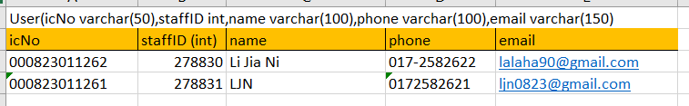

## Your Info:
|   Name    | Matric Number |  Phone Number  |
|:---------:|:-------------:|:--------------:|
| Li Jia Ni |    278830     |  017-258 2622  |

## Introduction
This Java Program provided a platform for all the desire users to conduct their booking room in University Utara Malaysia anywhere anytime via the telegram bot. 
All the features of the system such as booking room, cancel room and list out all the booked room for user only can be access by login user.
New user should provide personal details like name, staff id, phone and so on to complete the registration. After that the system will give instruction for login user while processing the activity.
## Flow Diagram of the requirements (Use: https://app.diagrams.net/)
>Flow diagram by using https://app.diagrams.net/

## Result/Output (Screenshot of the output)
>All the data is dummy data

### Register

### Login

### Booking

### Listing

### Cancellation

### Log Out

## UML Class Diagram
>UML Class Diagram generated by using eclipse JDE

## Database design
>Design database by using Excel

### User Database Design

### Room Database Design

### Booking Database Design

### Relationship of Database

## Youtube Presentation
[My Youtube Presentation](https://youtu.be/FpEyFaVZC-E)
## References (Not less than 10)
1. Taro L. Saito (2022) sqlite-jdbc [Source Code]. https://github.com/xerial/sqlite-jdbc
2. rubenlagus (2022) TelegramBots[Source Code]. https://github.com/rubenlagus/TelegramBots/wiki/Getting-Started
3. Telegram. (n.d.). Bot API Library Examples. Retrieved December 12, 2022, from https://core.telegram.org/bots/samples
4. Code Java. (2020, October 25). Java Connect to SQLite Database Example [Video]. YouTube. https://www.youtube.com/watch?v=293M9-QRZ0c
5. Azamat Ordabekov. (2021, November 11). How to create Telegram Bot in Java [Video]. YouTube. https://www.youtube.com/watch?v=XjOnp8TVNSQ
6. Fizz. (2020, June 23). Configuration JDBC drive with intlij IDEA || No suitable driver found for jdbc [Video]. YouTube. https://www.youtube.com/watch?v=duHgwpYLKZE
7. wikiHow. (2022, July 26). 3 Ways to Cite a GitHub Repository. Retrieved December 12, 2022, from https://www.wikihow.com/Cite-a-GitHub-Repository
8. Telegram Bot - Process response from user based on last bot question. (2019, December 15). Stack Overflow. Retrieved December 13, 2022, from https://stackoverflow.com/questions/59341135/telegram-bot-process-response-from-user-based-on-last-bot-question
9. Shift Academy. (2022, May 5). Java telegram bot PRO! [Video]. YouTube. Retrieved December 14, 2022, from https://www.youtube.com/watch?v=qdrCGjskHKQ
10. ArrayList in Java - javatpoint. (n.d.). www.javatpoint.com. Retrieved December 18, 2022, from https://www.javatpoint.com/java-arraylist
11. mkyong. (2019, June 6). JDBC PreparedStatement – Insert a row. Retrieved December 19, 2022, from https://mkyong.com/jdbc/jdbc-preparestatement-example-insert-a-record/
12. Batool, B. F. (n.d.). How to Get an Index of an Array Element in Java. Linuxhint. Retrieved December 19, 2022, from https://linuxhint.com/get-index-array-element-in-java/
13. Giri, R. (2019, July 30). Deleting the nth row in MySQL? Tutorialspoint. Retrieved December 19, 2022, from https://www.tutorialspoint.com/deleting-the-nth-row-in-mysql

## JavaDoc
### Package Page

### Class Page
Database class

Telegram class

User class

Booking class

